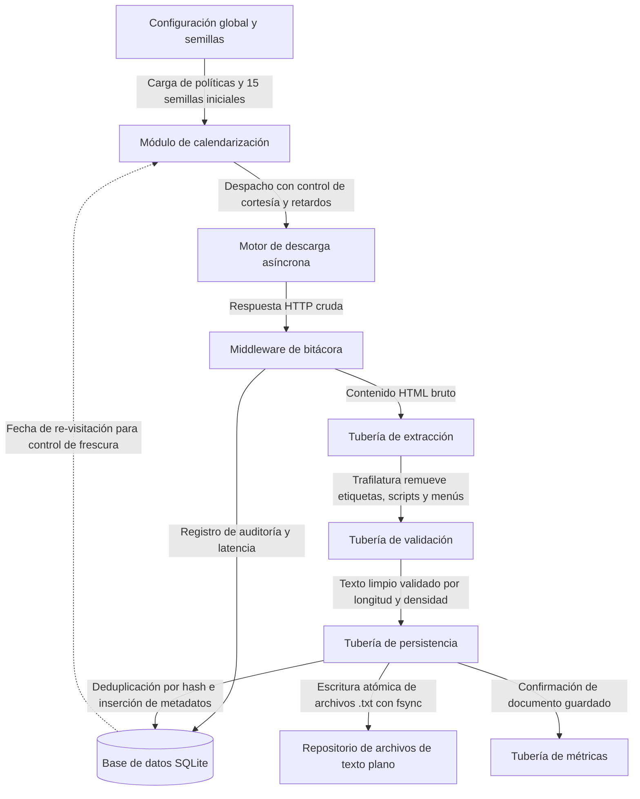

# Arañador web audiovisual para recuperación de información

Herramienta de recolección y preprocesamiento de información textual basada en Scrapy para el curso IC-8060 de Recuperación de Información Textual en el Tecnológico de Costa Rica. El sistema recorre fuentes del dominio audiovisual a partir de semillas dinámicas, extrae el texto principal limpio descartando elementos de maquetación y código web, gestiona duplicados y frescura, y almacena documentos planos con extensión `.txt` junto con sus metadatos y una bitácora de auditoría en SQLite.

---

## 1. Necesidad de información y caracterización del colectivo

### 1.1. Tema central y características de la información
* **Tema central:** Dominio audiovisual, enfocado en producciones cinematográficas, series de televisión, anime y guionismo.
* **Características de la información:** Textos extensos de alta densidad semántica, tales como guiones cinematográficos completos, transcripciones escena por escena, enciclopedias de tropos y estructuras argumentales, reseñas críticas especializadas y fichas técnicas. Se excluye el código web como HTML, hojas de estilo o scripts, así como archivos binarios o multimedia.
* **Tipo de consultas esperadas:**
  * Búsqueda de líneas de diálogo exactas o intercambios entre personajes.
  * Consultas temáticas sobre recursos narrativos, tales como *enemies to lovers*, arcos de redención o viajes en el tiempo.
  * Consultas cruzadas que combinan director, género o época, por ejemplo el estilo de diálogo de Quentin Tarantino o temas comunes en el anime de ciencia ficción de los noventa.

### 1.2. Caracterización del colectivo destino
* **Público objetivo:** Estudiantes de comunicación, cineastas en formación, guionistas, investigadores de narrativa audiovisual y aficionados al análisis crítico de medios.
* **Rango etario:** Personas de 18 a 45 años.
* **Contexto socioeconómico:** Comunidad universitaria y técnica de Costa Rica y de la región hispanohablante, con acceso a computadoras e internet, interesada en herramientas de búsqueda textual sin barreras económicas ni de suscripción.
* **Subtemas de interés:** Guiones de producción, análisis de tropos narrativos, narrativa comparada en animación y conservación digital de libretos.
* **Consultas esperadas por el colectivo:**
  * *Guion completo de Interstellar escena del agujero negro*
  * *Uso del tropo del antihéroe en películas de ciencia ficción*
  * *Transcripción del diálogo de apertura de Pulp Fiction*
  * *Evolución de tropos narrativos en series de anime clásicas*

---

## 2. Arquitectura y funcionamiento

La arquitectura del sistema sigue el modelo de control, calendarización desacoplada y almacenamiento estructurado:



### Ciclo de procesamiento secuencial
1. **Inicialización:** El archivo `semillas.txt` provee las 15 direcciones iniciales. La araña extrae dinámicamente los dominios permitidos sin fijar nombres de servidores en el código.
2. **Descarga:** El motor asíncrono consulta el archivo `robots.txt` del servidor, aplica las políticas de retardo y realiza las peticiones HTTP.
3. **Auditoría:** El intermediario de descarga captura cada respuesta o fallo de red y guarda una entrada en la tabla `bitacora_recorrido` de SQLite con el tiempo de respuesta, el código HTTP y el dominio.
4. **Cortesía en el documento:** La araña inspecciona las directivas de las etiquetas meta de robots y del encabezado `X-Robots-Tag`. Si detecta `noindex`, descarta el texto para almacenamiento; si detecta `nofollow`, interrumpe el seguimiento de enlaces salientes.
5. **Extracción de texto limpio:** La tubería de extracción procesa el HTML con Trafilatura para aislar el contenido principal, removiendo cabeceras, barras de navegación, anuncios y código JavaScript.
6. **Normalización y validación:** La tubería de validación calcula huellas digitales SHA-256 de la dirección y del contenido, descarta extensiones no deseadas y exige una longitud mínima de 300 caracteres con al menos 35 por ciento de densidad alfanumérica.
7. **Persistencia y deduplicación:** La tubería de almacenamiento comprueba si existen duplicados bajo transacciones inmediatas en SQLite, escribe el archivo `.txt` de forma atómica en el disco y registra sus metadatos.
8. **Control de frescura:** Si un documento ya fue almacenado pero su fecha de revisión ya venció, el sistema actualiza su contenido y renueva su marca temporal sin crear archivos redundantes.

---

## 3. Políticas de arañado

| Política | Tipo | Criterios y configuración | Metadatos asociados | Ubicación en código | Implementación técnica | Justificación temática y colectivo |
| :--- | :--- | :--- | :--- | :--- | :--- | :--- |
| **Límite de profundidad** | Selección | Profundidad máxima de 4 saltos de enlace | Campo `profundidad` | `configuracion.py:120`, `arana_semillas.py:225` | La araña corta la extracción de nuevos enlaces cuando el nivel alcanza el valor límite | Evita caer en trampas de enlaces infinitos y previene desviarse del tema audiovisual hacia secciones administrativas |
| **Exclusión de formatos binarios** | Selección | Descarte de más de 45 extensiones multimedia y ejecutables | Extensión de la ruta de la dirección | `configuracion.py:124`, `arana_semillas.py:161`, `tuberia_validacion.py:23` | Doble filtro mediante lista de exclusión en el extractor de enlaces y descarte con excepción en validación | El colectivo busca texto para lectura y búsqueda; descargar audio, video o comprimidos saturaría el ancho de banda sin aportar texto plano |
| **Calidad y densidad textual** | Selección | Mínimo de 300 caracteres y 35 por ciento de caracteres alfanuméricos | Campos `tamano_texto_bytes` y recuento de caracteres | `tuberia_extraccion.py:94`, `tuberia_validacion.py:372` | Trafilatura aísla el texto y la tubería descarta páginas cortas o con exceso de símbolos | Los guiones y ensayos son ricos en prosa; eliminar páginas de error o cascarones vacíos asegura un corpus útil para el indexador |
| **Prioridad en amplitud** | Selección | Reducción de prioridad según profundidad para procesar capas superiores | Campos `profundidad` y `priority` | `filtro_duplicados.py:84` | Resta de prioridad proporcional a la profundidad para que el calendarizador elija solicitudes superficiales | Favorece una cobertura amplia de obras y géneros diversos antes de profundizar en un catálogo específico |
| **Respeto a robots.txt** | Cortesía | Cumplimiento estricto de las directivas del servidor | Directivas de `robots.txt` del host | `configuracion.py:110` | El motor consulta automáticamente las reglas de cada servidor y bloquea accesos no permitidos | Garantiza un comportamiento ético y respeta las restricciones de acceso definidas por los administradores de los sitios |
| **Identificación de robot** | Cortesía | Identificador AranadorAudiovisualBot versión 1.0 con enlace institucional | Encabezado HTTP `User-Agent` | `configuracion.py:80`, `.env` | Envío de una cabecera descriptiva en cada solicitud web | Permite a los administradores distinguir la araña académica de ataques maliciosos sin exponer correos personales |
| **Cortesía en el documento** | Cortesía | Cumplimiento de directivas noindex y nofollow a nivel de página | Metadatos `robots` y cabecera `X-Robots-Tag` | `arana_semillas.py:197-240` | Inspección de etiquetas meta antes de emitir documentos o agendar enlaces salientes | Respeta la voluntad granular de los creadores de contenido que no desean que una página particular sea indexada o seguida |
| **Control de retardo y concurrencia** | Cortesía | Retardo base de medio segundo, concurrencia máxima de cuatro solicitudes por dominio y ajuste dinámico | Tiempo de respuesta y latencia observada | `configuracion.py:113-115, 194-199` | Mecanismo adaptativo que incrementa las pausas si el servidor remoto responde con lentitud | Protege los servidores comunitarios de guiones contra la degradación de servicio y bloqueos por saturación |
| **Deduplicación por dirección y contenido** | Revisitación | Huellas SHA-256 de la dirección canónica y del texto limpio | Campos `hash_url` y `hash_contenido` | `tuberia_almacenamiento.py:294`, `repositorio.py:362` | Verificación e inserción atómica bajo transacciones inmediatas en SQLite | Evita almacenar copias redundantes del mismo guion enlazado desde rutas espejo o parámetros de rastreo |
| **Control de frescura y re-visitación** | Revisitación | Ventana sugerida de 30 días posteriores a la descarga | Campos `fecha_descarga` y `fecha_revisitacion` | `filtro_duplicados.py:87`, `repositorio.py:220` | El filtro de duplicados omite direcciones vigentes y permite descargar aquellas cuya revisión haya caducado | Mantiene actualizada la colección ante correcciones de libretos o nuevas reseñas sin descargar todo el repositorio otra vez |
| **Auditoría del recorrido** | Auditoría | Registro persistente obligatorio de cada intento en base de datos | Campos `timestamp`, `dominio`, `url_destino`, `tiempo_ms`, `codigo_http` y `accion` | `intermediario_bitacora.py:157`, `repositorio.py:957` | Captura de eventos mediante señales e inserción en la tabla de bitácora | Permite demostrar la diversidad del recorrido entre múltiples sitios y constatar que no se descargó de un único dominio |

---

## 4. Guía de uso y tutorial de ejecución

### 4.1. Requisitos previos
* Sistema operativo Linux con Python versión 3.12 o superior.
* Gestor de entornos y paquetes `uv`.

### 4.2. Sincronización del entorno
Para preparar las dependencias y el entorno virtual:
```bash
uv sync --python 3.12
```

### 4.3. Configuración del proyecto
El proyecto carga sus variables desde el archivo `.env`. El archivo incluye valores predeterminados:
```dotenv
RAIZ_DATOS=.
USER_AGENT="AranadorAudiovisualBot/1.0 (+https://tec.ac.cr/ic8060)"
LOG_LEVEL=INFO
LOG_FILE=bitacoras/cosecha.log
INTERVALO_PROGRESO=15
OBJETIVO_GIB=10
```

### 4.4. Ejecución del proceso de cosecha
Para iniciar la recolección con visualización de progreso cada 15 segundos:
```bash
uv run arañador
```
Si el proceso se interrumpe con la combinación de teclas Control y C, es posible reanudarlo ejecutando el mismo comando. El estado se conserva mediante la cola en disco y el filtro persistente de la base de datos.

### 4.5. Generación del informe estadístico y curva de Zipf
Al finalizar la cosecha o al alcanzar el volumen deseado:
```bash
uv run arañador informe
```
Este comando ejecuta dos etapas de análisis automatizado:
1. **Exportación de estadísticas:** Concilia los archivos físicos en disco con la base de datos y genera archivos estructurados:
   * `resultados/estadisticas/estadisticas.json` con totales y coberturas.
   * `resultados/estadisticas/distribuciones.csv` con métricas por dominio y categoría.
   * `resultados/estadisticas/estadisticas.tex` con tablas listas para el informe en LaTeX.
2. **Cálculo de la Ley de Zipf:** Recorre todo el texto plano recolectado, cuenta frecuencias de palabras y produce:
   * `resultados/zipf/grafica_ley_zipf.png` con la curva empírica frente a la función teórica en escala logarítmica doble.
   * `resultados/zipf/estadisticas_zipf.json` con el vocabulario y la constante calculada.
   * `resultados/zipf/tabla_estadisticas.tex` con la tabla de rangos y frecuencias.

---

## 5. Comparativa técnica para la discusión de resultados

### 5.1. Comparativa entre Scrapy y la solución propia en Python

| Criterio de comparación | Solución con biblioteca Scrapy | Solución propia en Python |
| :--- | :--- | :--- |
| **Concurrencia y red** | Emplea un motor asíncrono con reactor no bloqueante, lo que permite atender cientos de solicitudes simultáneas con bajo consumo de memoria | Suele estructurarse con grupos de hilos de ejecución síncronos, limitados por el bloqueo global de intérprete y el costo de cambio de contexto del sistema operativo |
| **Gestión de protocolos y cortesía** | Incorpora de fábrica soporte maduro para interpretar robots.txt, demoras dinámicas, redirecciones HTTP y reintentos ante códigos de saturación | Requiere codificar manualmente desde cero el análisis de robots.txt, los temporizadores de cortesía y la máquina de estados de reintentos |
| **Modularidad de procesamiento** | Desacopla la extracción, validación y persistencia en una secuencia de tuberías e intermediarios con ciclo de vida gobernado por eventos | Tiende a integrar la descarga, limpieza y guardado dentro del mismo cuerpo de trabajo del hilo, dificultando aislar errores |
| **Curva de desarrollo y control** | Exige adaptarse a la arquitectura y convenciones del marco de trabajo, lo que puede limitar personalizaciones no contempladas | Otorga control absoluto del flujo de ejecución y simplifica la depuración paso a paso |

### 5.2. Casos de viabilidad e inviabilidad de Scrapy
* **Escenarios viables:**
  * Sitios web con contenido textual generado en el servidor, tales como repositorios de guiones, bibliotecas digitales y páginas informativas.
  * Proyectos que demandan recolección a escala de gigabytes con reanudación ante fallos y control estricto de cortesía sin sobrecargar la infraestructura local.
* **Escenarios inviables:**
  * Aplicaciones web de una sola página que dependen intensamente de JavaScript en el cliente para inyectar su texto. En estos casos Scrapy requeriría acoplar navegadores sin interfaz gráfica, perdiendo su ventaja de velocidad.
  * Páginas protegidas por muros de verificación interactiva o mecanismos de protección con desafíos dinámicos contra automatización.
  * Cosechas a escala global de toda la web repartidas en cientos de servidores, donde se prefieren arquitecturas distribuidas sobre clústeres como Apache Nutch.

---

## 6. Retos de ingeniería y problemas resueltos

Durante el diseño de la herramienta se superaron desafíos técnicos que debieron corregirse a nivel de arquitectura:

### 6.1. Inversión de prioridad en la cola de solicitudes
* **Problema:** Se buscaba aplicar un recorrido en amplitud dando prioridad a las páginas superficiales, pero el código incrementaba la prioridad con la profundidad.
* **Diagnóstico:** El despachador de prioridades de Scrapy procesa antes los valores numéricos más altos. Al sumar la profundidad, las páginas más lejanas se atendían primero, provocando un recorrido en profundidad.
* **Solución:** Se corrigió en el filtro de duplicados restando el valor proporcional a la profundidad. De este modo el nivel inicial conserva la mayor prioridad y los niveles profundos reciben valores negativos, garantizando una exploración por capas.

### 6.2. Consistencia atómica entre archivos en disco y base de datos
* **Problema:** Si el programa se cerraba abruptamente o la base de datos fallaba tras guardar un archivo de texto, quedaban archivos huérfanos sin fila correspondiente. Si se insertaba primero en la base y fallaba el disco, se registraban documentos inexistentes.
* **Solución:** La tubería de almacenamiento escribe el texto en un archivo temporal dentro de la misma carpeta, fuerza la sincronización a disco y directorio con llamadas a nivel de sistema operativo, e inserta en SQLite bajo transacciones inmediatas. Si ocurre un fallo o colisión, el archivo temporal se retira de inmediato.

### 6.3. Concurrencia y bloqueos en SQLite
* **Problema:** Múltiples componentes intentaban registrar información al mismo tiempo desde la bitácora y la tubería de persistencia, arrojando errores de base de datos bloqueada.
* **Solución:** Se configuró el diario en modo de registro por adelantado junto con un tiempo de espera de cinco segundos para operaciones concurrentes, posibilitando lecturas simultáneas mientras las escrituras se ordenan en serie de forma segura.

### 6.4. Trampas de rastreo y depuración de maquetación web
* **Problema:** Enlaces circulares con parámetros dinámicos generaban solicitudes infinitas, mientras que menús de navegación y anuncios alteraban el conteo de palabras del documento.
* **Solución:** Se limitó la profundidad a cuatro saltos, se descartaron extensiones no textuales y se integró Trafilatura en la primera etapa del flujo para despojar al contenido de maquetación parásita, exigiendo densidades alfanuméricas representativas antes de admitir cualquier texto.
